# 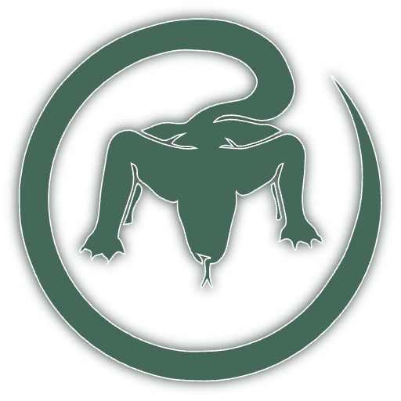 Komodo

Komodo is a Docker management UI which supports managing Docker containers and compose stacks across dozens of servers.  
In addition to Docker management, Komodo provides tools for building and deploying software, including Git integration, build pipelines and secret management.  

There is no limit to the number of servers you can connect, and there will never be. There is no limit to what API you can use for automation, and there never will be. No "business edition" here.

  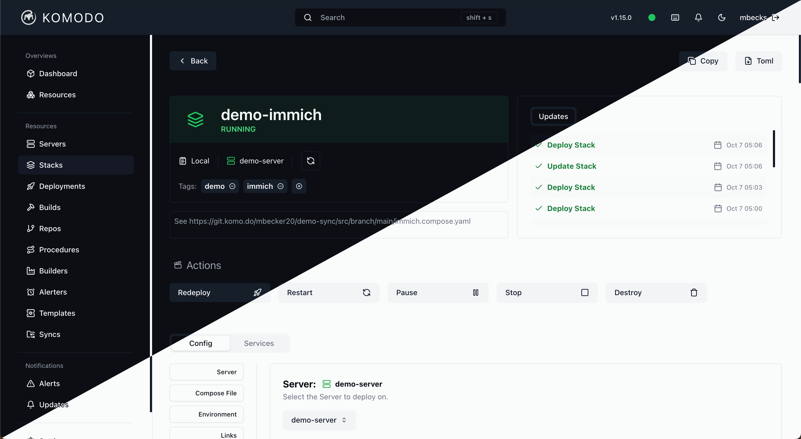

___

🦎 [See the docs](https://komo.do)  
🦎 [Try the Demo](https://demo.komo.do) - Login: `demo` : `demo`  
🦎 [See the Build Server](https://build.komo.do)  - Login: `komodo` : `komodo`  
🦎 [Join the Discord](https://discord.gg/DRqE8Fvg5c)  

## Features
### Container & Stack management
- Manage Docker containers
  - Create/Edtit/Remove
  - (Re)Deploy/Pull Images/Pause/Stop/Destroy
- Web Editor for compose and config files
- Web terminal to access containers
- Auto Update
  - Automatically update Containers or just notify when updates are available
- Pre and Post deployment scripts
- Private and Public Image Registries
- Templates
- Webhook support for automated redeployments

### Build Management
- Separate build servers
  - Build and Deploy on different servers to reduce load on production servers
- Auto version incrementing
- Source Dockerfile from Git, UI or filesystem
  - Supports Private Git Repositories
- Publish to Image Registries
  - Private and Public
- Pre build scripts
- Build args
- Webhook support for automated builds

### Server Management
- Resource monitoring
  - CPU, Memory, Disk, Network
- Per container resource usage
- Container, Network, Volume and Image listing and detail views
- Terminal (if activated in Periphery agent)

### Procedures
Create multistep procedures to automate complex workflows.
- Combine build, deployment and actions
- Automate scheduled updating of containers
- Start/Stop/Restart containers/stacks on a schedule
- Execute with Webhooks, scheduled or manually

### Actions
Script your own custom actions to do what you want.
- Automatically create new stacks
- Use external APIs
- Do whatever's not possible natively

[Action Docs](https://docs.rs/komodo_client/latest/komodo_client/api/index.html#modules)

### General
- Alerting
  - Filers to allow for spesific allerts only
  - Multiple providers
    - Discord
    - Slack
    - Ntfy
    - Pushover
    - More providers from the community => [Community Allerters](https://komo.do/docs/ecosystem/community#community-alerters)
- OIDC, GitHub and Google OAuth
- User Groups
- Granular, per-resource access control
- Per resource action log
  - See exactly who did what and when
- Dark/Ligh themes

## How to get started
Komodo needs a MongoDB database to store its data.  
If you're unable/don't want to run MongoDB, it is possible to use PostgreSQL with FerretDB *translating* between the two.

- [Setup Komodo with MongoDB](https://komo.do/docs/setup/mongo)
- [Setup Komodo with PostgreSQL and FerretDB](https://komo.do/docs/setup/ferretdb)
- [Add more servers to Komodo](https://komo.do/docs/setup/connect-servers)

## Screenshots

| Dark Theme | Light Theme |
|---|---|
| 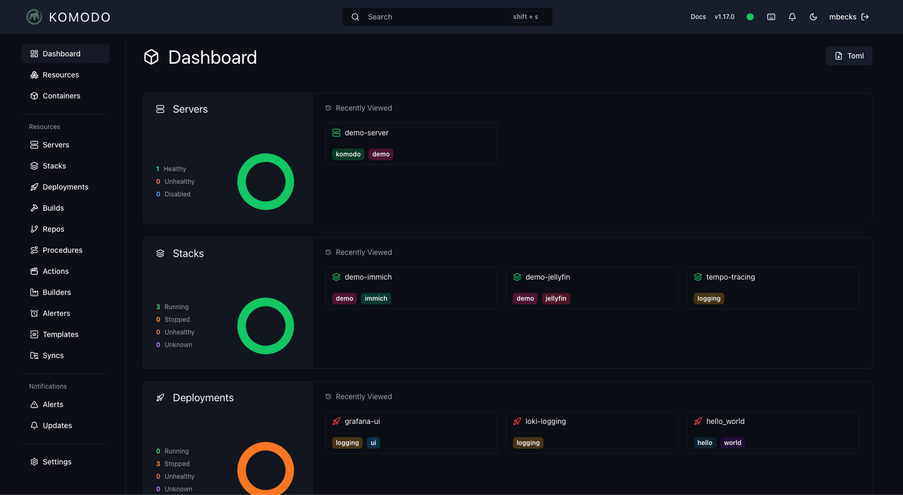 | 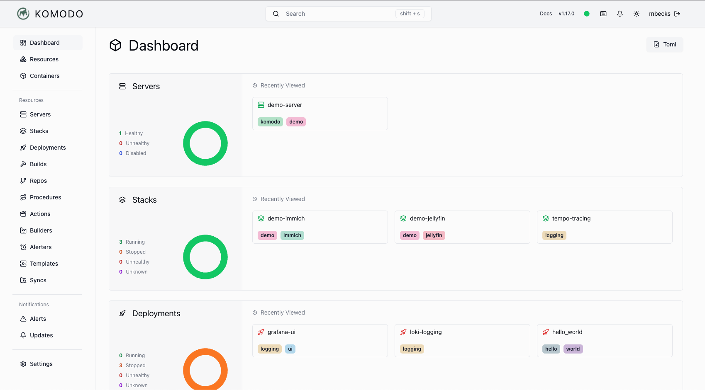 |
| 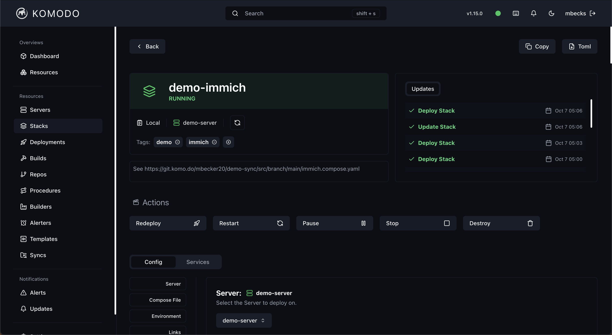 | 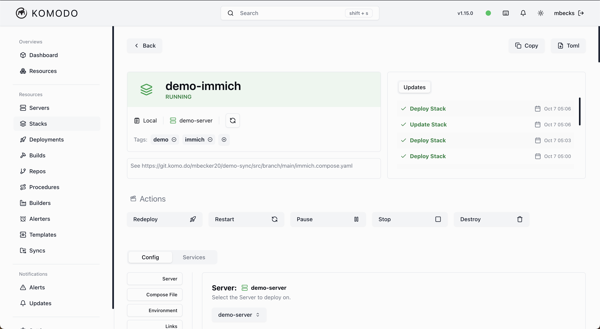 |
| 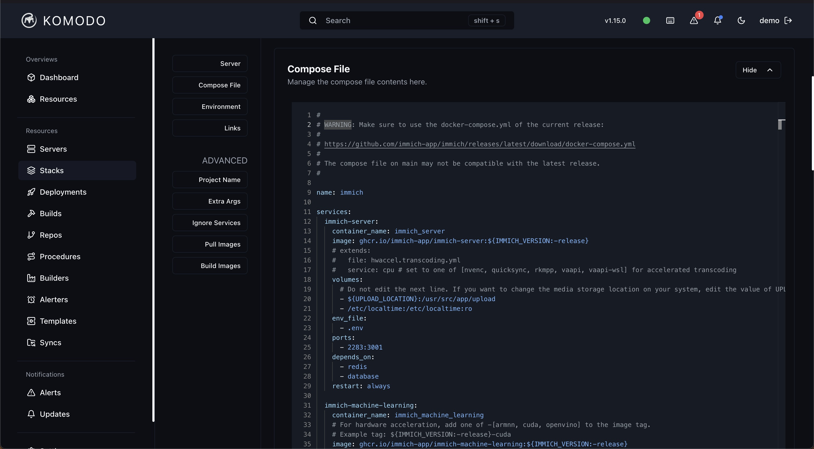 | 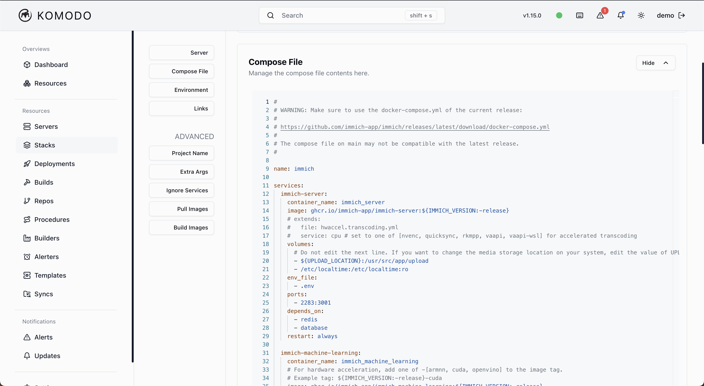 |
| 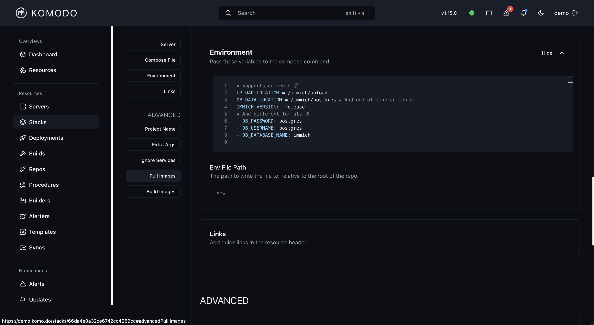 | 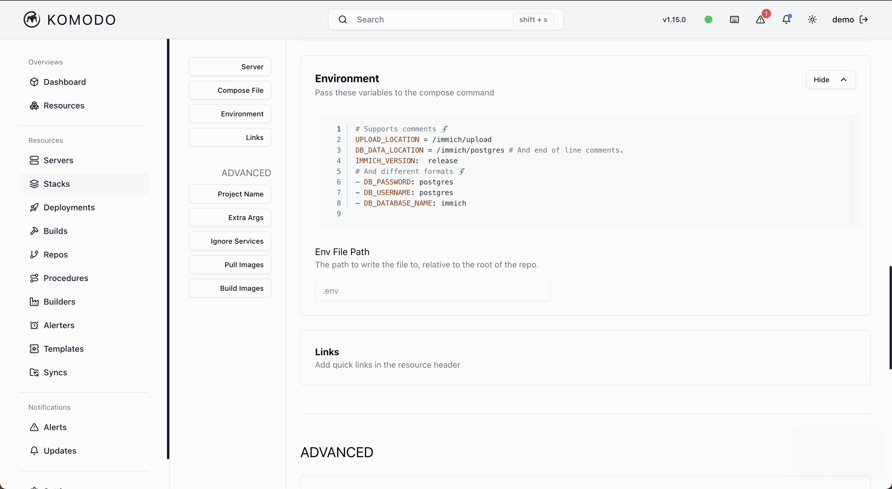 |
| 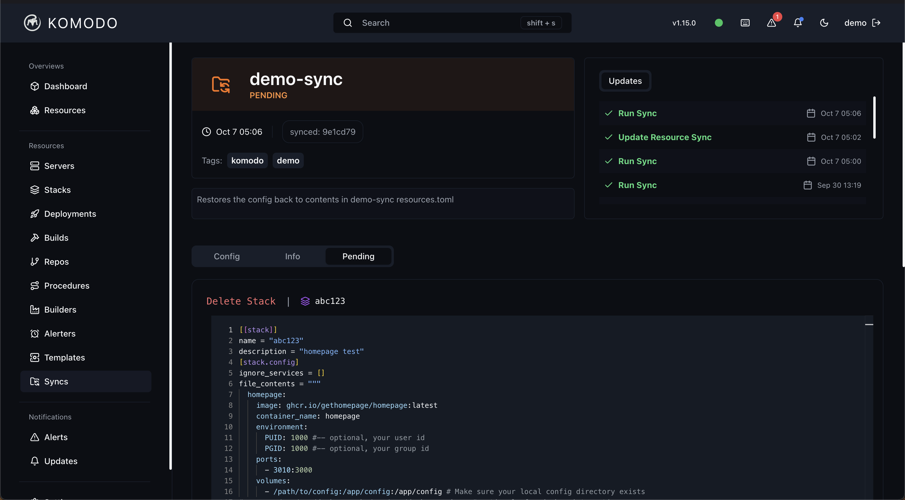 | 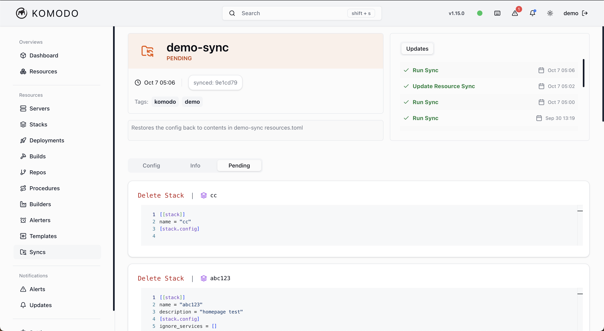 |
| 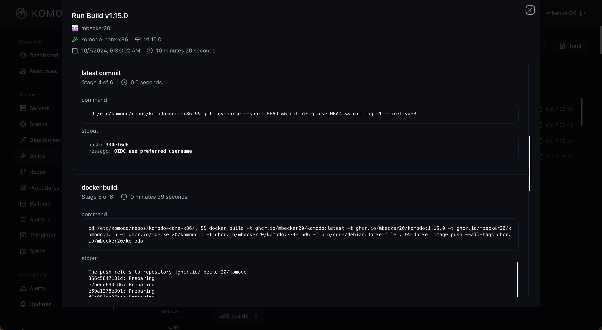 | 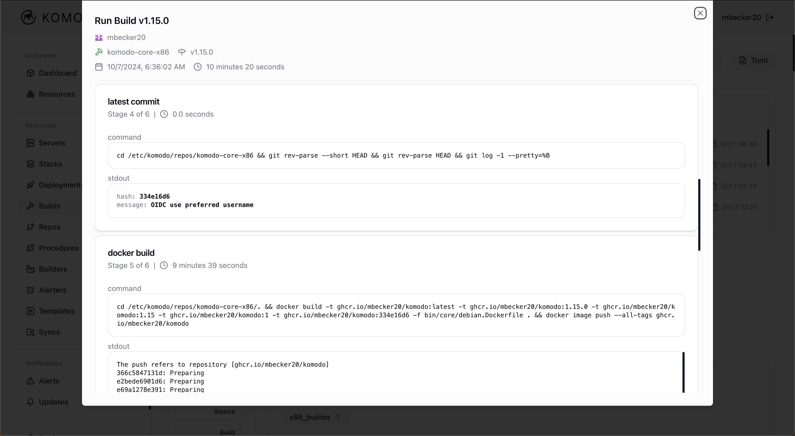 |
| 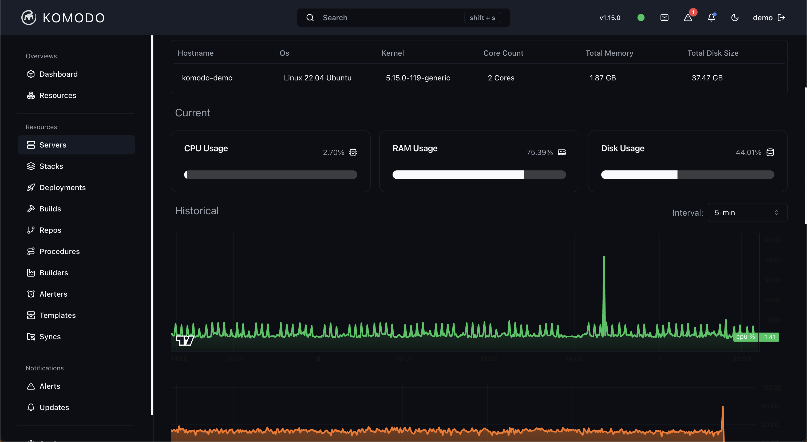 | 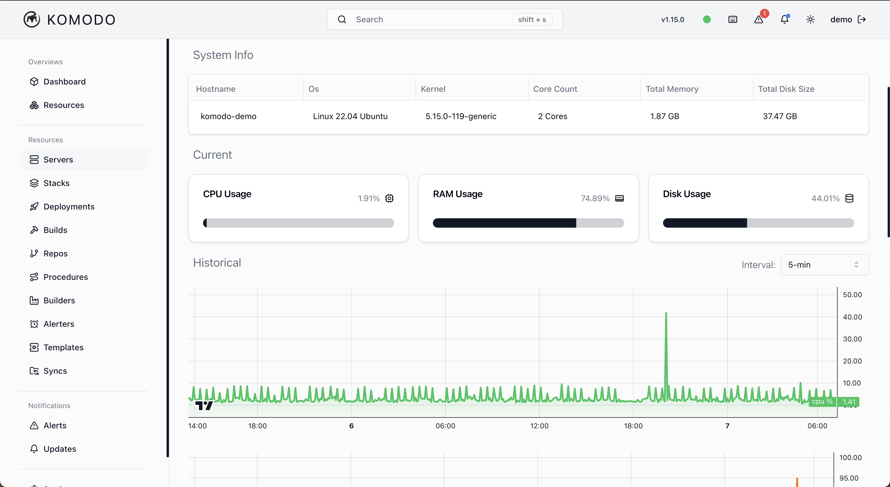 |
| 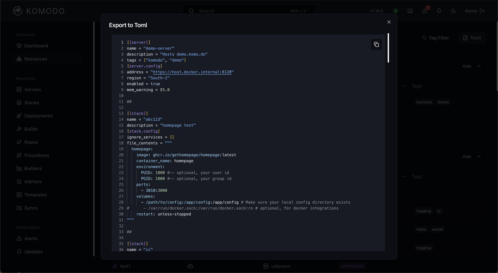 | 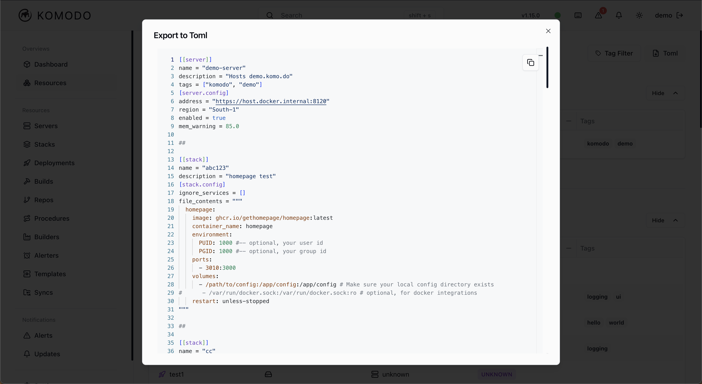 |

## Fun fact

The Komodo dragon is the largest living member of the [*Monitor* family of lizards](https://en.wikipedia.org/wiki/Monitor_lizard).

## Disclaimer

Warning. This is open source software (GPLv3), and while we make a best effort to ensure releases are stable and bug-free,
there are no warranties. Use at your own risk.